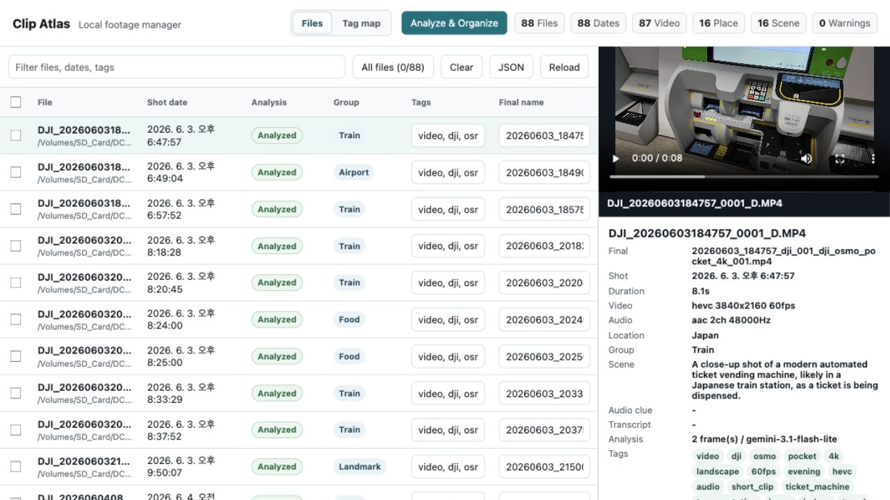
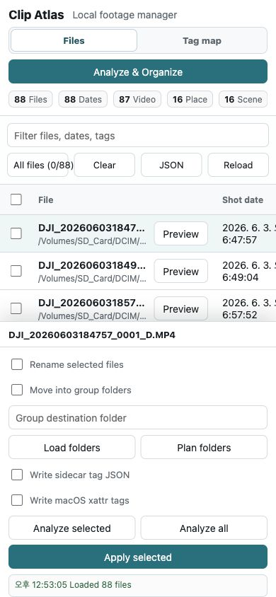
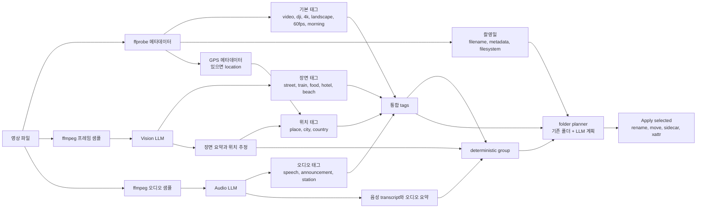
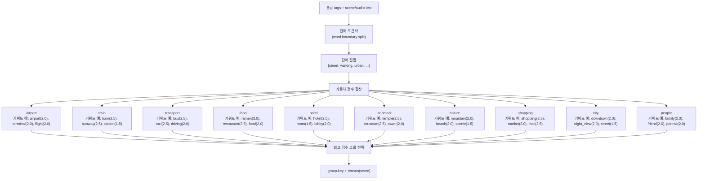

# Clip Atlas

`clip-indexer`는 여행 영상 파일을 읽고, 촬영일/메타데이터/태그/추천 파일명을 JSON으로 정리해주는 Go CLI이자 로컬 웹 파일 매니저입니다. 웹 UI에서는 LLM 장면 분석, 전체 선택, 폴더 플래닝, 파일 이동, 태그 sidecar 저장까지 처리할 수 있습니다.

전체 흐름은 이렇게 잡으면 됩니다.

1. SD 카드나 영상 폴더를 CLI에 넘깁니다.
2. JSON 리포트를 확인하거나 로컬 웹 UI를 엽니다.
3. 필요한 영상만 LLM으로 장면/위치/음성 힌트를 분석합니다.
4. 일부 파일 또는 전체 파일을 선택합니다.
5. 태그와 LLM 결과를 바탕으로 폴더 구조를 계획합니다.
6. 최종 파일명, 태그 JSON, macOS 메타데이터, 파일 이동을 적용합니다.

## 요구 사항

- Go 1.26+
- FFmpeg 도구가 `PATH`에 있어야 합니다.
  - `ffprobe`: 영상 메타데이터 읽기
  - `ffmpeg`: LLM 분석용 프레임/오디오 추출

확인:

```bash
go version
ffprobe -version
ffmpeg -version
```

## 빠른 시작

JSON 리포트 출력:

```bash
go run ./cmd/clip-indexer --pretty --trip "Japan 2026" /Volumes/SD_Card/DCIM/100MEDIA
```

하위 폴더까지 기본으로 스캔합니다:

```bash
go run ./cmd/clip-indexer --pretty /Volumes/SD_Card/DCIM/100MEDIA
```

로컬 웹 UI 실행:

```bash
go run ./cmd/clip-indexer serve --trip "Japan 2026" /Volumes/SD_Card/DCIM/100MEDIA
```

### 목업 샘플로 먼저 보기

실제 SD 카드가 없어도 샘플 영상과 분석 캐시를 만들어 작업 흐름을 확인할 수 있습니다. 생성되는 샘플은 AI 생성 이미지를 바탕으로 만든 10초 H.264/AAC `.mp4`이고, 컷을 붙인 슬라이드쇼가 아니라 DJI/짐벌로 찍은 듯한 안정적인 싱글테이크 모션을 넣습니다.

샘플 생성:

```bash
scripts/create-mock-filelist.sh
```

JSON 리포트 확인:

```bash
go run ./cmd/clip-indexer --pretty --trip "Mock Trip" tmp/mock-filelist/DCIM
```

마인드맵, 파일명/폴더 변경안, 적용 payload까지 dry-run으로 묶어 보기:

```bash
scripts/review-mock-workflow.sh
```

직접 실행하려면:

```bash
go run ./cmd/clip-indexer review \
  --pretty \
  --trip "Mock Trip" \
  --dest-root tmp/mock-filelist/organized \
  --out-dir tmp/mock-filelist/review \
  tmp/mock-filelist/DCIM
```

웹 UI 실행:

```bash
go run ./cmd/clip-indexer serve --port 0 --trip "Mock Trip" tmp/mock-filelist/DCIM
```

`--pretty`는 JSON을 들여쓰기해서 터미널에서 읽기 좋게 출력합니다. `review`는 실제 파일을 이동하지 않고 `report.json`, `mindmap.mmd`, `folder-plan.json`, `rename-plan.csv`, `apply-request.json`, `summary.md`를 생성합니다. `serve`는 브라우저에서 작업하는 로컬 웹 UI를 띄웁니다. `--port 0`은 비어 있는 포트를 자동으로 고릅니다. 폴더 플랜/정리 흐름까지 테스트할 때는 `tmp/mock-filelist/organized`를 root로 지정하면 됩니다.

샘플 검증:

```bash
scripts/verify-mock-filelist.sh
```

샘플 생성 프롬프트, 기대 태그, 기대 그룹은 `fixtures/mock-filelist/manifest.json`에 저장되어 있습니다. 분석 프롬프트를 바꾼 뒤 별도 report를 비교하려면 `scripts/compare-mock-analysis.py <report.json>`를 실행하면 됩니다.

프롬프트와 캡쳐 간격 튜닝:

```bash
RUN_LIVE_LLM=1 scripts/tune-vision-analysis.sh
```

이 명령은 실제 LLM vision 호출을 여러 번 실행하므로 API 비용이 들 수 있습니다. 후보 프롬프트는 `fixtures/mock-filelist/vision-prompts/`에 있고, 기본 비교 간격은 2초, 3초, 5초, 10초입니다. 결과는 `tmp/vision-tuning/results.csv`에 저장됩니다.

외부 모델로 더 좋은 이미지를 만들 때는 `fixtures/mock-filelist/gemini-asset-request.md`를 참고해 `fixtures/mock-filelist/assets/`의 PNG를 교체하면 됩니다. 주제 선정까지 LLM에 맡기려면 `fixtures/mock-filelist/llm-topic-brief.md`를 사용하면 됩니다.

바이너리 빌드:

```bash
go build -o clip-indexer ./cmd/clip-indexer
./clip-indexer serve /Volumes/SD_Card/DCIM/100MEDIA
```

버전 확인:

```bash
./clip-indexer --version
```

## 명령어

`index`는 기본 명령어입니다. 영상 목록을 분석하고 JSON을 stdout으로 출력합니다.

```bash
go run ./cmd/clip-indexer index --pretty ~/Movies/trip
go run ./cmd/clip-indexer --pretty ~/Movies/trip
```

`serve`는 로컬 웹 파일 매니저를 실행합니다.

```bash
go run ./cmd/clip-indexer serve ~/Movies/trip
```

주요 옵션:

```text
--recursive, -r              하위 폴더까지 스캔, 기본값 true
--pretty                     JSON 보기 좋게 출력
--trip                       추천 파일명에 포함할 여행/프로젝트 이름
--ffprobe                    ffprobe 실행 파일 경로
--ffmpeg                     ffmpeg 실행 파일 경로
--llm                        메타데이터 기반 LLM 보강
--llm-vision                 영상 프레임을 샘플링해 장면/위치 힌트 분석
--llm-audio                  오디오를 추출해 음성/소리 힌트 분석
--vision-frames              영상당 샘플링할 프레임 수
--vision-sample-interval     N초마다 vision frame을 샘플링, 0이면 --vision-frames 사용
--vision-max-items           vision 분석 최대 파일 수, 0이면 전체
--vision-prompt-file         vision 분석용 system prompt 파일
--audio-max-seconds          오디오 샘플 길이
--audio-max-items            audio 분석 최대 파일 수, 0이면 전체
--llm-base-url               OpenAI 호환 API base URL
--llm-api-key                LLM API 키
--llm-model                  LLM 모델명
--audio-model                오디오 transcription 모델명
--auto-analyze               웹 UI 시작 시 자동 분석 실행
--auto-analyze-max-items     자동 분석 최대 파일 수, 0이면 전체
```

## 로컬 환경 변수

API 키는 `.env.local`에 넣으면 됩니다. 이 파일은 git에 올라가지 않습니다.

OpenAI 호환 예시:

```bash
OPENAI_API_KEY=...
OPENAI_MODEL=...
OPENAI_AUDIO_MODEL=whisper-1
```

공통 LLM 변수명도 사용할 수 있습니다.

```bash
LLM_API_KEY=...
LLM_MODEL=...
LLM_BASE_URL=https://api.openai.com/v1
LLM_AUDIO_MODEL=whisper-1
```

Gemini를 Google의 OpenAI 호환 endpoint로 쓰는 예시:

```bash
LLM_API_KEY=...
LLM_BASE_URL=https://generativelanguage.googleapis.com/v1beta/openai/
LLM_MODEL=gemini-3.1-flash-lite
```

현재 앱에서는 Gemini 호환 base URL일 때 vision 분석 경로를 사용합니다. Whisper 스타일의 `/audio/transcriptions` 경로는 Gemini 호환 base URL에서는 자동으로 건너뜁니다.

## 웹 UI 사용 흐름

실행:

```bash
go run ./cmd/clip-indexer serve --trip "Japan 2026" /Volumes/SD_Card/DCIM/100MEDIA
```

터미널에 localhost URL이 출력됩니다. 그 주소를 브라우저에서 열면 됩니다.

### 화면 예시

데스크톱에서는 파일 목록, 미리보기, 메타데이터 패널을 한 화면에서 같이 확인할 수 있습니다.



모바일에서는 상단 액션과 목록/적용 컨트롤이 세로로 정리됩니다.



왼쪽 목록에서 볼 수 있는 것:

- 원본 파일명과 경로
- 촬영 날짜
- LLM 분석 상태
- 추천 그룹 또는 계획된 폴더
- 편집 가능한 태그
- 편집 가능한 최종 파일명

오른쪽 패널에서 볼 수 있는 것:

- PC에서는 고정된 영상 preview/detail 패널
- 모바일에서는 preview modal
- 선택한 클립 메타데이터
- 분석 진행 상태
- apply 컨트롤
- JSON panel
- 로그

선택 컨트롤:

- `Select all`: 현재 보이는 row를 선택하거나 해제합니다.
- `All files`: 필터가 걸려 있어도 indexed 된 전체 파일을 선택합니다.
- `Clear`: 현재 선택을 모두 해제합니다.

## LLM 분석

선택 파일 분석:

1. 분석할 row를 선택합니다.
2. `Analyze selected`를 누릅니다.
3. row 상태가 `Queued`, `Analyzing`, `Warning`, `Analyzed`로 바뀌는 것을 확인합니다.

전체 pending 파일 분석:

1. `All files`를 누릅니다.
2. `Analyze all`을 누릅니다.

웹 UI 시작과 동시에 자동 분석:

```bash
go run ./cmd/clip-indexer serve \
  --auto-analyze \
  --auto-analyze-max-items 3 \
  --trip "Japan 2026" \
  /Volumes/SD_Card/DCIM/100MEDIA
```

`--auto-analyze-max-items 0`은 pending 파일 전체를 분석합니다. vision/audio 분석은 API 비용이 들 수 있고, 샘플링된 프레임/오디오가 설정한 LLM provider로 전송됩니다.

분석 중에는 터미널에도 progress bar가 표시됩니다.

## 분석 캐시

LLM 분석이 성공하면 영상 옆에 캐시가 저장됩니다.

```text
video.mp4.clip-analysis.json
```

같은 폴더를 다시 열면 Clip Atlas가 이 캐시를 먼저 읽습니다. 그래서 이미 분석한 장면 설명, 위치 추정, 태그, 그룹, 추천 최종 파일명이 바로 표시되고 LLM을 다시 호출하지 않습니다.

다음 값이 달라지면 stale cache로 보고 건너뜁니다.

- 원본 파일명
- 촬영 날짜
- 영상 길이

생성 파일은 git ignore에 포함되어 있습니다.

```text
*.clip-analysis.json
*.clip-tags.json
```

## 태그 맵

태그는 파일명/메타데이터에서 만든 기본 태그, LLM vision/audio 분석 태그, 위치 힌트를 합쳐서 만들어집니다. 이 통합 태그가 그룹 추천과 폴더 플래닝의 입력이 됩니다.



기본 그룹은 아래처럼 태그와 장면 요약 텍스트를 단어 단위로 토큰화한 뒤, 각 키워드의 가중치 점수를 합산하여 가장 높은 점수의 그룹으로 분류합니다. 단순 부분 문자열(substring) 매칭이 아닌 정확한 단어 경계 매칭을 사용하므로, `bustling` 속의 `bus`가 교통 수단으로 잘못 분류되는 문제가 발생하지 않습니다.



## 분류 알고리즘 (Score-Weighted Word Matching)

영상 분류는 LLM이 반환한 태그, 장면 요약, 오디오 요약, 위치 추정 텍스트를 모두 합쳐서 단어 단위로 토큰화한 뒤, 10개 그룹 각각의 키워드 가중치 점수를 합산하여 결정합니다.

핵심 개선점:

- **단어 경계 매칭**: `strings.Contains` 대신 텍스트를 공백/특수문자 기준으로 분리하여 정확한 전체 단어만 매칭합니다. `bustling`이 `bus`로 잘못 매칭되거나 `storefronts`가 `store`로 매칭되는 오류가 해결되었습니다.
- **가중치 점수 합산**: 각 키워드에 1.0~3.0 사이의 가중치가 부여됩니다. 여러 그룹의 키워드가 동시에 매칭될 경우, 총점이 가장 높은 그룹이 선택됩니다.
- **한국어/영어 이중 지원**: 모든 그룹에 한국어 키워드가 포함되어 있어, 한국어로 된 태그나 장면 요약도 자연스럽게 분류됩니다.

분류 결과의 `reason` 필드에는 매칭된 대표 키워드와 총 점수가 함께 표시됩니다 (예: `train (score: 29.0)`).

### Mock vs Real 분석 비교

`CLIP_INDEXER_SAVE_REAL=1` 환경 변수를 설정하면 기존 mock 캐시를 무시하고 실제 LLM 분석을 실행한 뒤, 결과를 `.clip-analysis.json.real` 파일로 별도 저장합니다. 기존 `.clip-analysis.json`과 비교하여 프롬프트 튜닝에 활용할 수 있습니다.

```bash
CLIP_INDEXER_SAVE_REAL=1 go run ./cmd/clip-indexer --pretty --llm-vision tmp/mock-filelist/DCIM
```

## 폴더 플래닝과 파일 이동

Clip Atlas에는 두 가지 정리 방식이 있습니다.

태그 기반 그룹핑:

- 각 파일은 deterministic `group` 값을 가집니다.
- 기본 그룹은 airport, train, transport, food, hotel, landmark, nature, shopping, city, people, other 입니다.
- 영어 태그와 한국어 태그를 모두 참고합니다.

LLM 폴더 플래닝:

1. 파일을 선택하거나 `All files`를 누릅니다.
2. `Group destination folder`에 이동 대상 루트 폴더를 입력합니다.
3. `Load folders`를 눌러 기존 하위 폴더 목록을 불러옵니다.
4. `Plan folders`를 누릅니다.
5. 계획된 folder chip과 row의 group/folder 표시를 확인합니다.
6. 괜찮으면 `Apply selected`를 누릅니다.

플래너가 참고하는 정보:

- 현재 태그
- LLM 장면 요약
- 오디오 힌트
- GPS 또는 위치 추정
- deterministic group
- 대상 루트 아래의 기존 하위 폴더 목록

LLM 플래닝이 실패하거나 credential이 없으면 태그 기반 그룹핑으로 fallback 됩니다.

Dry-run 리뷰 번들:

```bash
go run ./cmd/clip-indexer review \
  --trip "Japan 2026" \
  --dest-root /Volumes/TravelDrive/organized \
  --out-dir tmp/clip-atlas-review/japan-2026 \
  /Volumes/SD_Card/DCIM/100MEDIA
```

`review`는 분석 리포트, Mermaid mindmap, 폴더 플랜, rename CSV, 적용 요청 JSON을 한 폴더에 저장합니다. 실제 이동은 하지 않으므로, `summary.md`와 `rename-plan.csv`를 보고 괜찮을 때 웹 UI에서 같은 destination root로 적용하면 됩니다. `--llm-folder-plan`을 추가하면 LLM credential이 있을 때 폴더 구조 설계에도 LLM을 사용하고, 실패하면 deterministic group 폴더로 fallback 됩니다.

상단 `Analyze selected` / `Organize files` 버튼:

1. `Group destination folder`에 이동 대상 루트 폴더를 입력합니다.
2. 분석할 파일을 선택한 뒤 `Analyze selected`를 눌러 장면/오디오 분석을 먼저 실행합니다.
3. 목록의 `Analysis` 컬럼에서 `Queued`, `Analyzing`, `Warning`, `Analyzed` 상태를 확인합니다.
4. 정리할 파일을 선택한 뒤 `Organize files`를 누르면 폴더 플랜을 만들고 대상 루트 아래로 이동합니다.
5. 대상 루트 최상단에 `clip-atlas-map.json`을 저장합니다.

이 map JSON에는 분석 결과, 폴더 계획, 원본 경로, 최종 경로, 적용 결과가 같이 들어갑니다. 대상 루트의 기존 하위 폴더는 depth 제한 없이 읽습니다.

작업 아이디어:

- `Organize files` 실행 전에 dry-run preview를 보여주고, 파일 이동은 별도 확인 단계에서만 실행하기
- map JSON을 다시 불러와 이전 정리 계획과 현재 폴더 상태를 비교하기
- 모바일에서 긴 파일명/경로를 더 쉽게 훑을 수 있도록 row detail drawer 추가하기
- folder plan 결과를 태그 맵 화면과 연결해 폴더별 클립 분포를 시각화하기

Apply 동작:

- `Move into group folders`가 켜져 있으면 선택 파일을 대상 루트 아래로 이동합니다.
- 폴더 플랜이 있으면 각 파일은 계획된 상대 폴더로 이동합니다.
- 폴더 플랜이 없으면 deterministic group 폴더로 이동합니다.
- target path를 먼저 검사합니다.
- 기존 파일은 덮어쓰지 않습니다.
- 분석 캐시와 태그 sidecar가 있으면 영상과 같이 이동합니다.

예시:

```text
Destination root:
/Volumes/TravelDrive/Japan-2026

Planned target:
train/station

Moved file:
/Volumes/TravelDrive/Japan-2026/train/station/20260603_184757_station_ticket_001.mp4
```

## 메타데이터 저장

Apply panel에서 선택할 수 있습니다.

- `Rename selected files`: 최종 파일명으로 rename 또는 move 합니다.
- `Write sidecar tag JSON`: `video.mp4.clip-tags.json`을 저장합니다.
- `Write macOS xattr tags`: `com.clipatlas.tags` xattr에 메타데이터를 저장합니다.

Sidecar JSON에 포함되는 값:

- 원본/최종 파일명
- 태그
- 위치 정보
- 장면/오디오 요약
- 그룹
- 영상 길이와 포맷

## 안전 장치

- 기존 파일을 덮어쓰지 않습니다.
- 파일 이동에는 destination root 입력이 필요합니다.
- 계획된 폴더는 destination root 아래의 상대 경로만 허용합니다.
- 분석만으로는 파일을 rename/move 하지 않습니다.
- 실제 파일 변경은 `Apply selected`를 눌렀을 때만 일어납니다.
- 처음 테스트할 때는 원본 SD 카드가 아니라 복사본으로 테스트하는 것을 추천합니다.

## JSON 출력 예시

```json
{
  "source_path": "/Volumes/SD_Card/DCIM/100MEDIA/CLIP_20260603_184757_ticket_machine.MP4",
  "original_file_name": "CLIP_20260603_184757_ticket_machine.MP4",
  "extension": ".mp4",
  "shot_at": "2026-06-03T18:47:57+09:00",
  "shot_at_source": "filename_datetime",
  "duration_seconds": 8.107,
  "location": {
    "label": "Kansai International Airport",
    "source": "llm_vision",
    "confidence": 0.9
  },
  "content": {
    "scene_summary": "A traveler is using a train ticket machine.",
    "location_guess": "Kansai International Airport, Japan",
    "tags": ["ticket_machine", "train", "japan"],
    "model": "gemini-3.1-flash-lite"
  },
  "group": {
    "key": "train",
    "label": "Train",
    "folder": "train",
    "reason": "train"
  },
  "tags": ["video", "ticket_machine", "train", "japan"],
  "recommended_file_name": "20260603_184757_japan_ticket_machine_001.mp4",
  "final_file_name": "20260603_184757_kansai_ticket_machine_001.mp4"
}
```

## 개발

테스트:

```bash
go test ./...
```

제한된 macOS sandbox 환경에서 Go build cache가 막히면:

```bash
GOCACHE=/private/tmp/clip-indexer-gocache go test ./...
```

고정 포트로 웹 UI 실행:

```bash
go run ./cmd/clip-indexer serve --port 52993 /Volumes/SD_Card/DCIM/100MEDIA
```

## 릴리즈

브랜치와 태그 릴리즈 흐름은 [docs/branching-release.md](docs/branching-release.md)를 참고하면 됩니다. `vMAJOR.MINOR.PATCH` 태그를 push하면 GitHub Actions가 Linux, macOS, Windows용 바이너리 아카이브와 `SHA256SUMS.txt`를 GitHub Release에 업로드합니다.

자동 검증/배포용 prerelease는 `release/auto` 브랜치에 push하면 됩니다. 이 브랜치는 최신 release tag의 patch 버전을 자동으로 올려 `vX.Y.Z-auto.YYYYMMDD.RUN.SHORTSHA` tag를 생성하고, 해당 tag로 `Release` workflow를 dispatch합니다. 예를 들어 최신 tag가 `v0.1.1-auto...`이면 다음 자동 릴리즈는 `v0.1.2-auto...`가 됩니다. 릴리즈 노트의 `Features` 섹션은 `feat: ...` commit 제목에서 자동 생성됩니다.
