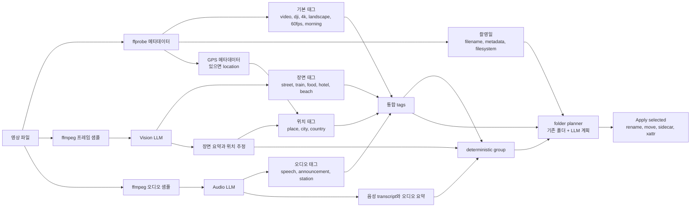
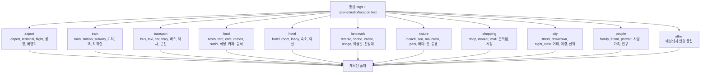

# Clip Atlas

`clip-indexer`는 여행 영상 파일을 읽고, 촬영일/메타데이터/태그/추천 파일명을 JSON으로 정리해주는 Go CLI이자 로컬 웹 파일 매니저입니다. 웹 UI에서는 LLM 장면 분석, 전체 선택, 폴더 플래닝, 파일 이동, 태그 sidecar 저장까지 처리할 수 있습니다.

전체 흐름은 이렇게 잡으면 됩니다.

1. SD 카드나 영상 폴더를 CLI에 넘깁니다.
2. JSON 리포트를 확인하거나 로컬 웹 UI를 엽니다.
3. 필요한 영상만 LLM으로 장면/위치/음성 힌트를 분석합니다.
4. 일부 파일 또는 전체 파일을 선택합니다.
5. 태그와 LLM 결과를 바탕으로 폴더 구조를 계획합니다.
6. 최종 파일명, 태그 JSON, macOS 메타데이터, 파일 이동을 적용합니다.

## 요구 사항

- Go 1.26+
- FFmpeg 도구가 `PATH`에 있어야 합니다.
  - `ffprobe`: 영상 메타데이터 읽기
  - `ffmpeg`: LLM 분석용 프레임/오디오 추출

확인:

```bash
go version
ffprobe -version
ffmpeg -version
```

## 빠른 시작

JSON 리포트 출력:

```bash
go run ./cmd/clip-indexer --pretty --trip "Japan 2026" /Volumes/SD_Card/DCIM/DJI_001
```

하위 폴더까지 스캔:

```bash
go run ./cmd/clip-indexer --recursive --pretty /Volumes/SD_Card/DCIM/DJI_001
```

로컬 웹 UI 실행:

```bash
go run ./cmd/clip-indexer serve --recursive --trip "Japan 2026" /Volumes/SD_Card/DCIM/DJI_001
```

바이너리 빌드:

```bash
go build -o clip-indexer ./cmd/clip-indexer
./clip-indexer serve --recursive /Volumes/SD_Card/DCIM/DJI_001
```

## 명령어

`index`는 기본 명령어입니다. 영상 목록을 분석하고 JSON을 stdout으로 출력합니다.

```bash
go run ./cmd/clip-indexer index --pretty ~/Movies/trip
go run ./cmd/clip-indexer --pretty ~/Movies/trip
```

`serve`는 로컬 웹 파일 매니저를 실행합니다.

```bash
go run ./cmd/clip-indexer serve --recursive ~/Movies/trip
```

주요 옵션:

```text
--recursive, -r              하위 폴더까지 스캔
--pretty                     JSON 보기 좋게 출력
--trip                       추천 파일명에 포함할 여행/프로젝트 이름
--ffprobe                    ffprobe 실행 파일 경로
--ffmpeg                     ffmpeg 실행 파일 경로
--llm                        메타데이터 기반 LLM 보강
--llm-vision                 영상 프레임을 샘플링해 장면/위치 힌트 분석
--llm-audio                  오디오를 추출해 음성/소리 힌트 분석
--vision-frames              영상당 샘플링할 프레임 수
--vision-max-items           vision 분석 최대 파일 수, 0이면 전체
--audio-max-seconds          오디오 샘플 길이
--audio-max-items            audio 분석 최대 파일 수, 0이면 전체
--llm-base-url               OpenAI 호환 API base URL
--llm-api-key                LLM API 키
--llm-model                  LLM 모델명
--audio-model                오디오 transcription 모델명
--auto-analyze               웹 UI 시작 시 자동 분석 실행
--auto-analyze-max-items     자동 분석 최대 파일 수, 0이면 전체
```

## 로컬 환경 변수

API 키는 `.env.local`에 넣으면 됩니다. 이 파일은 git에 올라가지 않습니다.

OpenAI 호환 예시:

```bash
OPENAI_API_KEY=...
OPENAI_MODEL=...
OPENAI_AUDIO_MODEL=whisper-1
```

공통 LLM 변수명도 사용할 수 있습니다.

```bash
LLM_API_KEY=...
LLM_MODEL=...
LLM_BASE_URL=https://api.openai.com/v1
LLM_AUDIO_MODEL=whisper-1
```

Gemini를 Google의 OpenAI 호환 endpoint로 쓰는 예시:

```bash
LLM_API_KEY=...
LLM_BASE_URL=https://generativelanguage.googleapis.com/v1beta/openai/
LLM_MODEL=gemini-3.1-flash-lite
```

현재 앱에서는 Gemini 호환 base URL일 때 vision 분석 경로를 사용합니다. Whisper 스타일의 `/audio/transcriptions` 경로는 Gemini 호환 base URL에서는 자동으로 건너뜁니다.

## 웹 UI 사용 흐름

실행:

```bash
go run ./cmd/clip-indexer serve --recursive --trip "Japan 2026" /Volumes/SD_Card/DCIM/DJI_001
```

터미널에 localhost URL이 출력됩니다. 그 주소를 브라우저에서 열면 됩니다.

왼쪽 목록에서 볼 수 있는 것:

- 원본 파일명과 경로
- 촬영 날짜
- LLM 분석 상태
- 추천 그룹 또는 계획된 폴더
- 편집 가능한 태그
- 편집 가능한 최종 파일명

오른쪽 패널에서 볼 수 있는 것:

- PC에서는 고정된 영상 preview/detail 패널
- 모바일에서는 preview modal
- 선택한 클립 메타데이터
- 분석 진행 상태
- apply 컨트롤
- JSON panel
- 로그

선택 컨트롤:

- `Select all`: 현재 보이는 row를 선택하거나 해제합니다.
- `All files`: 필터가 걸려 있어도 indexed 된 전체 파일을 선택합니다.
- `Clear`: 현재 선택을 모두 해제합니다.

## LLM 분석

선택 파일 분석:

1. 분석할 row를 선택합니다.
2. `Analyze selected`를 누릅니다.
3. row 상태가 `Queued`, `Analyzing`, `Warning`, `Analyzed`로 바뀌는 것을 확인합니다.

전체 pending 파일 분석:

1. `All files`를 누릅니다.
2. `Analyze all`을 누릅니다.

웹 UI 시작과 동시에 자동 분석:

```bash
go run ./cmd/clip-indexer serve \
  --recursive \
  --auto-analyze \
  --auto-analyze-max-items 3 \
  --trip "Japan 2026" \
  /Volumes/SD_Card/DCIM/DJI_001
```

`--auto-analyze-max-items 0`은 pending 파일 전체를 분석합니다. vision/audio 분석은 API 비용이 들 수 있고, 샘플링된 프레임/오디오가 설정한 LLM provider로 전송됩니다.

분석 중에는 터미널에도 progress bar가 표시됩니다.

## 분석 캐시

LLM 분석이 성공하면 영상 옆에 캐시가 저장됩니다.

```text
video.mp4.clip-analysis.json
```

같은 폴더를 다시 열면 Clip Atlas가 이 캐시를 먼저 읽습니다. 그래서 이미 분석한 장면 설명, 위치 추정, 태그, 그룹, 추천 최종 파일명이 바로 표시되고 LLM을 다시 호출하지 않습니다.

다음 값이 달라지면 stale cache로 보고 건너뜁니다.

- 원본 파일명
- 촬영 날짜
- 영상 길이

생성 파일은 git ignore에 포함되어 있습니다.

```text
*.clip-analysis.json
*.clip-tags.json
```

## 태그 맵

태그는 파일명/메타데이터에서 만든 기본 태그, LLM vision/audio 분석 태그, 위치 힌트를 합쳐서 만들어집니다. 이 통합 태그가 그룹 추천과 폴더 플래닝의 입력이 됩니다.



기본 그룹은 아래처럼 태그와 장면 요약을 기준으로 매칭됩니다. LLM 폴더 플래닝은 이 그룹을 그대로 쓰거나, 기존 하위 폴더 목록과 장면 정보를 보고 더 구체적인 상대 경로를 제안합니다.



## 폴더 플래닝과 파일 이동

Clip Atlas에는 두 가지 정리 방식이 있습니다.

태그 기반 그룹핑:

- 각 파일은 deterministic `group` 값을 가집니다.
- 기본 그룹은 airport, train, transport, food, hotel, landmark, nature, shopping, city, people, other 입니다.
- 영어 태그와 한국어 태그를 모두 참고합니다.

LLM 폴더 플래닝:

1. 파일을 선택하거나 `All files`를 누릅니다.
2. `Group destination folder`에 이동 대상 루트 폴더를 입력합니다.
3. `Load folders`를 눌러 기존 하위 폴더 목록을 불러옵니다.
4. `Plan folders`를 누릅니다.
5. 계획된 folder chip과 row의 group/folder 표시를 확인합니다.
6. 괜찮으면 `Apply selected`를 누릅니다.

플래너가 참고하는 정보:

- 현재 태그
- LLM 장면 요약
- 오디오 힌트
- GPS 또는 위치 추정
- deterministic group
- 대상 루트 아래의 기존 하위 폴더 목록

LLM 플래닝이 실패하거나 credential이 없으면 태그 기반 그룹핑으로 fallback 됩니다.

Apply 동작:

- `Move into group folders`가 켜져 있으면 선택 파일을 대상 루트 아래로 이동합니다.
- 폴더 플랜이 있으면 각 파일은 계획된 상대 폴더로 이동합니다.
- 폴더 플랜이 없으면 deterministic group 폴더로 이동합니다.
- target path를 먼저 검사합니다.
- 기존 파일은 덮어쓰지 않습니다.
- 분석 캐시와 태그 sidecar가 있으면 영상과 같이 이동합니다.

예시:

```text
Destination root:
/Volumes/TravelDrive/Japan-2026

Planned target:
train/station

Moved file:
/Volumes/TravelDrive/Japan-2026/train/station/20260603_184757_station_ticket_001.mp4
```

## 메타데이터 저장

Apply panel에서 선택할 수 있습니다.

- `Rename selected files`: 최종 파일명으로 rename 또는 move 합니다.
- `Write sidecar tag JSON`: `video.mp4.clip-tags.json`을 저장합니다.
- `Write macOS xattr tags`: `com.clipatlas.tags` xattr에 메타데이터를 저장합니다.

Sidecar JSON에 포함되는 값:

- 원본/최종 파일명
- 태그
- 위치 정보
- 장면/오디오 요약
- 그룹
- 영상 길이와 포맷

## 안전 장치

- 기존 파일을 덮어쓰지 않습니다.
- 파일 이동에는 destination root 입력이 필요합니다.
- 계획된 폴더는 destination root 아래의 상대 경로만 허용합니다.
- 분석만으로는 파일을 rename/move 하지 않습니다.
- 실제 파일 변경은 `Apply selected`를 눌렀을 때만 일어납니다.
- 처음 테스트할 때는 원본 SD 카드가 아니라 복사본으로 테스트하는 것을 추천합니다.

## JSON 출력 예시

```json
{
  "source_path": "/Volumes/SD_Card/DCIM/DJI_001/DJI_20260603184757_0001_D.MP4",
  "original_file_name": "DJI_20260603184757_0001_D.MP4",
  "extension": ".mp4",
  "shot_at": "2026-06-03T18:47:57+09:00",
  "shot_at_source": "filename_datetime",
  "duration_seconds": 8.107,
  "location": {
    "label": "Kansai International Airport",
    "source": "llm_vision",
    "confidence": 0.9
  },
  "content": {
    "scene_summary": "A traveler is using a train ticket machine.",
    "location_guess": "Kansai International Airport, Japan",
    "tags": ["ticket_machine", "train", "japan"],
    "model": "gemini-3.1-flash-lite"
  },
  "group": {
    "key": "train",
    "label": "Train",
    "folder": "train",
    "reason": "train"
  },
  "tags": ["video", "dji", "ticket_machine", "train", "japan"],
  "recommended_file_name": "20260603_184757_dji_001.mp4",
  "final_file_name": "20260603_184757_kansai_ticket_machine_001.mp4"
}
```

## 개발

테스트:

```bash
go test ./...
```

제한된 macOS sandbox 환경에서 Go build cache가 막히면:

```bash
GOCACHE=/private/tmp/clip-indexer-gocache go test ./...
```

고정 포트로 웹 UI 실행:

```bash
go run ./cmd/clip-indexer serve --recursive --port 52993 /Volumes/SD_Card/DCIM/DJI_001
```
